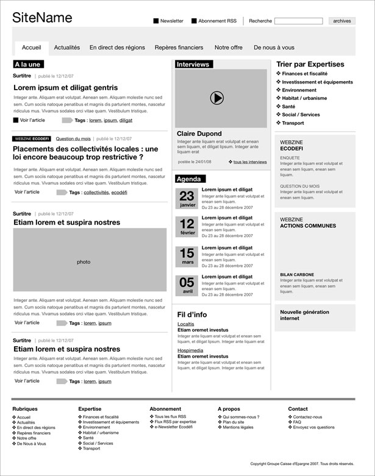

# CSS_Frameworks

Testing out different CSS frameworks to narrow down the best results to possibly use as a standard moving foward. All using the same mockup found on the interwebz by my friend [Travis Nielson](http://github.com/travisneilson).

- 01 PureCSS - [purecss.io](http://purecss.io) 
- 02 Bootstrap - [getbootstrap.com](http://getbootstrap.com)
- 03 Skeleton - [getskeleton.com](http://getskeleton.com)

